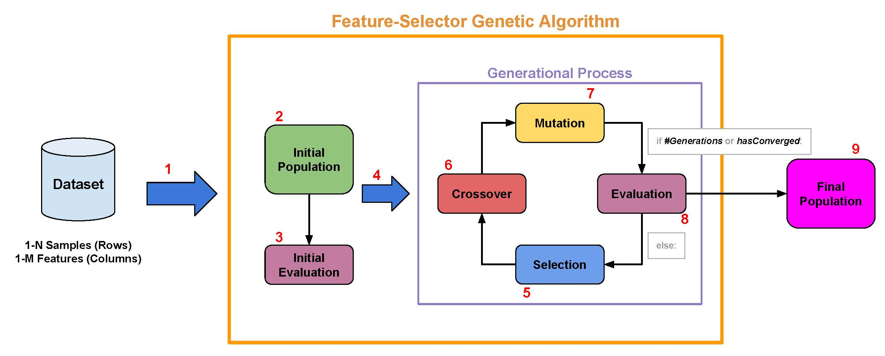
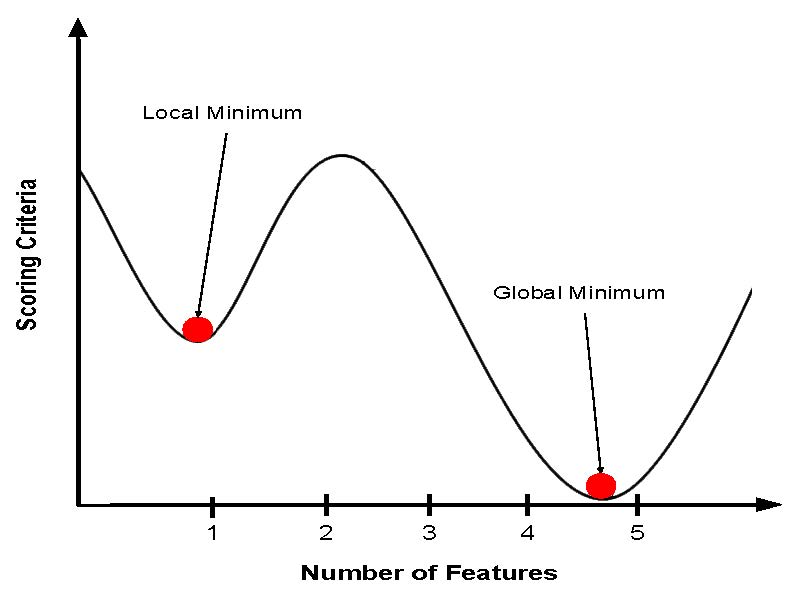
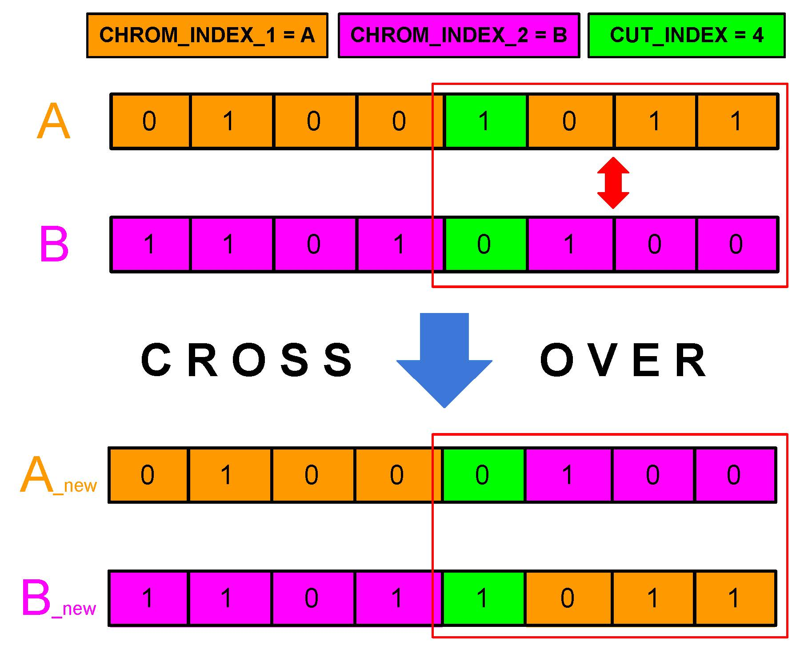
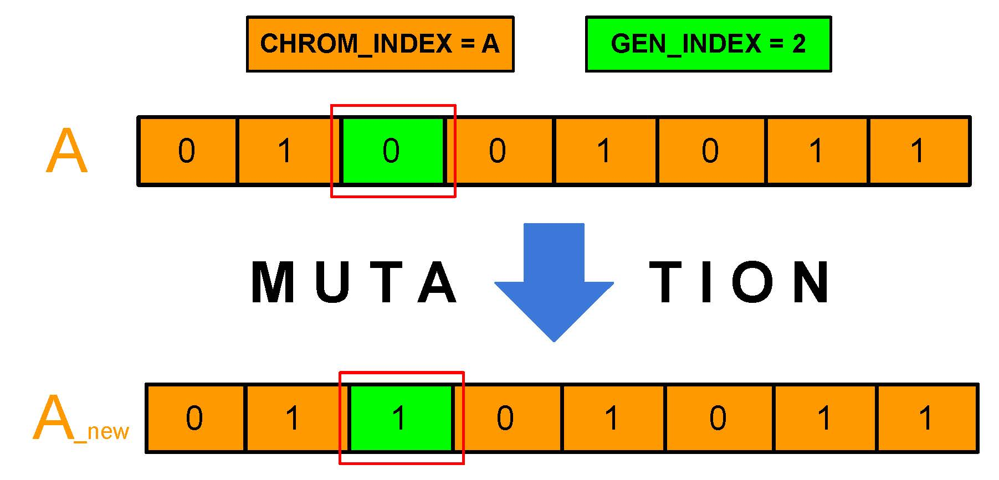

<a href="http://atvs.ii.uam.es/atvs/">
    
</a>

# Feature-Selector Genetic Algorithm

This repository contains the **Python implementation of a genetic algorithm developed by the BiDA Lab team**. This algorithm was created to **choose the best subset of features from a original dataset**.

## Table of content

- [Article](#article)
- [Installation](#install)
- [Requirements](#requirements)
- [How Does It Works?](#howdoesitworks)
  - [Selection](#selection)
  - [Crossover](#crossover)
  - [Mutation](#mutation)
  - [Evaluation](#evaluation)
- [Class Parameters](#parameters)
- [Example of use](#example)
- [References](#references)

<br/>

## <a name="article">Article</a>

**NOTE: This project is licensed in accordance with the terms of the licence CC BY-NC-SA 4.0. Remember to make reference to the next article in any work that is made public, in whatever form, based directly or indirectly on the use of the Feature-Selector Genetic Algorithm.**

- R. Tolosana, J.C. Ruiz-Garcia, R. Vera-Rodriguez, J. Herreros-Rodriguez, S. Romero-Tapiador, A. Morales and J. Fierrez, **"Child-Computer Interaction: Recent Works, New Dataset, and Age Detection"**, *IEEE Transactions on Emerging Topics in Computing*, doi: [10.1109/TETC.2022.3150836](https://www.doi.org/10.1109/TETC.2022.3150836), 2022.

<br/>

## <a name="install">Installation</a>

Simply clone this repository and run `python setup.py install`.

To uninstall run `pip uninstall genetic_selector`.

<br/>

## <a name="requirements">Requirements</a>

- Python >= 3.6
- numpy >= 1.18
- pandas >= 1.0.1

<br/>

### <a name="howdoesitworks">How Does It Works?</a>

The genetic algorithm is a **metaheuristic algorithm based on Charles Darwin's theory of evolution**. In particular, it is **inspired on the natural selection process of evolution**, where over generations and through the use of operators such as **mutation, crossover and selection**, a positive evolution towards better solutions occurs. Originally, the genetic algorithm was created as a search algorithm, but in this case, it has been adapted to find the subset of features that works best for a given problem.

<br/>



<br/>

From the original dataset, with *N* samples and *M* features, **an initial population of size** [`population_size`](#population_size_par) **chromosomes is randomly created**. A chromosome is a binary array of size N (number of features), where 1 represents that the feature at that position is selected and 0 that it is not. Each chromosome represents a solution (a subset of selected features). Therefore, the initial population has [`population_size`](#population_size_par) initial solutions.

**Once the initial population is defined, it is [evaluated](#evaluation)** to obtain the quality of each chromosome (solution) in the population and to find the best one. Then, the generational process of natural selection begins.

<br/>

**During the generational process there are 4 steps**: 

1. The first step is to create a new population through the **[selection process](#selection)**. 
2. In the second step, the **[crossover process](#crossover)** takes place. 
3. The third step involves the **[mutation process](#mutation)**. 
4. And finally, the new population (selected, crossed and mutated from the original one in the previous generation) is **[evaluated](#evaluation)**. 

**These 4 steps will be repeated until one of the following situations occurs**:

- The defined number of generations ([`n_gen`](#n_gen_par)) is reached.
- The algorithm converges. That is, for a number of `threshold_times_convergence` generations the best result found in the population is always the same. This means that the algorithm has fallen into a local minimum/maximum. The `threshold_times_convergence` value initially takes value 5 and from generation 17 its value increases according to the number of generations taken. This allows for a deeper search as the number of generations increases.

<br/>

<p align="center">
  
</p>

<br/>

When the process terminates, the *support()* function call returns:

1. The best chromosome (subset of features) obtained over all generations.
2. The results for the validation set generation by generation.
3. The results for the training set generation by generation. If the variable [`calc_train_score`](#calc_train_score_par) is `true`.
4. A history of the best chromosome (subset of characteristics) obtained generation by generation.


<br/>

### <a name="selection">Selection</a>

In the process, **a new population is created by selecting those chromosomes (solutions) from the previous population that are the strongest (with the best** [`scoring`](#scoring_par)**)**. The new population must have the same [`population_size`](#population_size_par) size as the old one. For this purpose, a **tournament process** is carried out.

Initially, **the best solution from the previous population is always added** to ensure this solution in the next population. Then, **an iterative process is repeated until the new population is complete**:

1. From the previous population, [`tournament_k`](#tournament_k_par) chromosomes are randomly selected.
2. The [`tournament_k`](#tournament_k_par) chromosomes selected face against each other.
3. The chromosome with the best [`scoring`](#scoring_par) is selected and added to the new population.

------

### <a name="crossover">Crossover</a>

The crossover operation **takes cares of generating new solutions by mixing the chromosomes (solutions) of the new population**. Each chromosome is a binary array of 0 and 1. The crossover operator **selects a random cut position and performs the combination between two chromosomes**.

<br/>

<p align="center">
  
</p>

<br/>

The number of crossovers to be applied to the new population is calculated using the [`crossover_rate`](#crossover_rate_par), the [`population_size`](#population_size_par) and mathematical hope.

```bash
n_crossovers = crossover_rate * (population_size / 2)
```

------

### <a name="mutation">Mutation</a>

The mutation operation **takes cares of generating new solutions by altering some genes in the chromosomes (solutions) of the new population**. Each chromosome is a binary matrix of 0 and 1. The mutation operator **selects a random chromosome from the new population**. From that chromosome it **selects a random gene (feature) and alters its value by changing 0 to 1 and vice versa**.

<br/>

<p align="center">
  
</p>

<br/>

The number of mutations to be applied to the new population is calculated using the [`mutation_rate`](#mutation_rate_par), the [`population_size`](#population_size_par), the number of genes per chromosome *(M)* and mathematical hope.

```bash
n_mutations = mutation_rate * population_size * M
```

------

### <a name="evaluation">Evaluation</a>

In this process, the population of chromosomes (possible solutions) is evaluated through the defined [`scoring`](#scoring_par) to find the best solution. To be able to evaluate each chromosome, the following is needed:

- A supervised learning [`estimator`](#estimator_par) with a *fit* method from Scikit-learn. The estimator can be a classifier or a regressor.
- A defined [`scoring`](#scoring_par) to quantitatively measure the quality of a solution (chromosome).
- A defined cross-validation splitting strategy ([`cv`](#cv_par)).

For each chromosome (subset of features) in the population, an estimator is trained using the training set defined by the [`cv`](#cv_par). Then, the model is evaluated with the validation set and the [`scoring`](#scoring_par) defined. If the [`cv`](#cv_par) defines a fixed validation set, it will be evaluated only, otherwise, an average will be performed.

------

<br/>

## <a name="parameters">Parameters</a>

This section defines the input parameters of the Feature-Selector Genetic Algorithm class:

|Parameter|Value|Default|Definition|
|-------------|:-------------:|:-----:|:-----:|
|<a name="estimator_par">`estimator`</a>|object||A supervised learning estimator with a *fit* method from Scikit-learn.
|<a name="scoring_par">`scoring`</a>|str, callable, or None|None|If None (default), uses 'accuracy' for sklearn classifiers and 'r2' for sklearn regressors.<br/>If str, uses a sklearn scoring metric string identifier, for example {accuracy, f1, precision, recall, roc_auc} for classifiers, {'mean_absolute_error', 'mean_squared_error'/'neg_mean_squared_error', 'median_absolute_error', 'r2'} for regressors.
|<a name="cv_par">`cv`</a>|int, cross-validation generator or iterable|None|Determines the cross-validation splitting strategy. Possibilities are:<br/>- None, to use the default 5-fold cross validation,<br/>- int, to specify the number of folds in a (Stratified)KFold,<br/>- :term: CV splitter,<br/>- An iterable yielding (train, test) splits as arrays of indices.
|<a name="n_gen_par">`n_gen`</a>|int|50|Determines the maximum number of generations to be carry out.
|<a name="population_size_par">`population_size`</a>|int|100|Determines the size of the population (number of chromosomes).
|<a name="crossover_rate_par">`crossover_rate`</a>|float|0.7|Defines the crossing probability. It must be a value between 0.0 and 1.0.
|<a name="mutation_rate_par">`mutation_rate`</a>|float|1.0|Defines the mutation probability. It must be a value between 0.0 and 1.0. 
|<a name="tournament_k_par">`tournament_k`</a>|int|2|Defines the size of the tournament carried out in the selection process. Number of chromosomes facing each other in each tournament.
|<a name="calc_train_score_par">`calc_train_score`</a>|bool|False|Whether or not to calculate the scores obtained during the training process.<br/>The calculation of training scores is used to obtain information on how different parameter settings affect the overfitting/underfitting trade-off. However, calculating the scores in the training set can be computationally expensive and is not strictly necessary to select the parameters that produce the best generalisation performance.
|<a name="initial_best_chromosome_par">`initial_best_chromosome`</a>|np.ndarray|None|A 1-dimensional binary matrix of size equal to the number of features (M). Defines the best chromosome (subset of features) in the initial population.
|<a name="n_jobs_par">`n_jobs`</a>|int|1|Number of cores to run in parallel. By default a single-core is used.<br/>`n_jobs = -1` means the maximum number of cores on the machine. If the inserted `n_jobs` is greater than the maximum number of cores on the machine, then the value is set to the maximum number of cores on the machine. 
|<a name="random_state_par">`random_state`</a>|int or RandomState instance|None|Controls the randomness of the life cycle in each population. Enter an integer for reproducible output.
|<a name="verbose_par">`verbose`</a>|int|0|Control the output verbosity level. It must be an integer value between 0 and 2.

<br/>

## <a name="example">Example of Use</a>

```python
import pandas as pd
import numpy as np
from genetic_selector import GeneticSelector
from sklearn import datasets
from sklearn.ensemble import RandomForestClassifier
from sklearn.model_selection import train_test_split

if __name__ == '__main__':
    # Set random state
    random_state = 42
    
    # Define estimator
    rf_clf = RandomForestClassifier(n_estimators=300, random_state=random_state)

    # Load example dataset from Scikit-learn
    dataset = datasets.load_wine()
    X = pd.DataFrame(data=dataset['data'])
    y = pd.Series(data=dataset['target'])

    # Split into train and test
    train_X, test_X, train_y, test_y = train_test_split(X, y, test_size=0.20, random_state=random_state)

    # Set a initial best chromosome for first population
    best_chromosome = np.array([1, 1, 0, 0, 0, 0, 0, 0, 0, 0, 1, 1, 0])

    # Create GeneticSelector instance
    # You should not set the number of cores (n_jobs) in the Scikit-learn
    # model to avoid UserWarning. The genetic selector is already parallelizable.
    genetic_selector = GeneticSelector(
        estimator=rf_clf, cv=5, n_gen=30, population_size=10,
        crossover_rate=0.8, mutation_rate=0.15, tournament_k=2,
        calc_train_score=True, initial_best_chromosome=best_chromosome,
        n_jobs=-1, random_state=random_state, verbose=0)
    
    # Fit features
    genetic_selector.fit(train_X, train_y)

    # Show the results
    support = genetic_selector.support()
    best_chromosome = support[0][0]
    score = support[0][1]
    best_epoch = support[0][2]
    print(f'Best chromosome: {best_chromosome} -> (Selected Features IDs: {np.where(best_chromosome)[0]})')
    print(f'Best score: {score}')
    print(f'Best epoch: {best_epoch}')

    test_scores = support[1]
    train_scores = support[2]
    chromosomes_history = support[3]
    print(f'Test scores: {test_scores}')
    print(f'Train scores: {train_scores}')
    print(f'Chromosomes history: {chromosomes_history}')
```
```bash
C:\Users\User\example>python example_of_use.py

# Creating initial population with 10 chromosomes...
# Evaluating initial population...
# Current best chromosome: (array([1, 1, 0, 0, 0, 0, 0, 0, 0, 0, 1, 1, 0]), 0.9502463054187192, 0)

# Creating generation 1...
# Selection 1 done.
# Crossover 1 done.
# Mutation 1 done.
# Evaluating population of new generation 0...
# (BETTER) A better chromosome than the current one has been found (0.9788177339901478).
# Current best chromosome: (array([1, 1, 0, 0, 1, 0, 1, 0, 0, 0, 1, 0, 0]), 0.9788177339901478, 1)
# Elapsed generation time: 3.28 seconds

# Creating generation 2...
# Selection 2 done.
# Crossover 2 done.
# Mutation 2 done.
# Evaluating population of new generation 1...
# (WORST) No better chromosome than the current one has been found (0.9716748768472907).
# Current best chromosome: (array([1, 1, 0, 0, 1, 0, 1, 0, 0, 0, 1, 0, 0]), 0.9788177339901478, 1)
# Elapsed generation time: 3.16 seconds

# Creating generation 3...
# Selection 3 done.
# Crossover 3 done.
# Mutation 3 done.
# Evaluating population of new generation 2...
# (WORST) No better chromosome than the current one has been found (0.9785714285714286).
# Current best chromosome: (array([1, 1, 0, 0, 1, 0, 1, 0, 0, 0, 1, 0, 0]), 0.9788177339901478, 1)
# Elapsed generation time: 3.14 seconds

........

# Creating generation 28...
# Selection 28 done.
# Crossover 28 done.
# Mutation 28 done.
# Evaluating population of new generation 27...
# Same scoring value found 2/8 times.
# Current best chromosome: (array([1, 1, 0, 1, 1, 0, 1, 1, 1, 0, 1, 0, 0]), 0.9928571428571429, 26)
# Elapsed generation time: 3.19 seconds

# Creating generation 29...
# Selection 29 done.
# Crossover 29 done.
# Mutation 29 done.
# Evaluating population of new generation 28...
# Same scoring value found 3/8 times.
# Current best chromosome: (array([1, 1, 0, 1, 1, 0, 1, 1, 1, 0, 1, 0, 0]), 0.9928571428571429, 26)
# Elapsed generation time: 3.10 seconds

# Creating generation 30...
# Selection 30 done.
# Crossover 30 done.
# Mutation 30 done.
# Evaluating population of new generation 29...
# Same scoring value found 4/8 times.
# Current best chromosome: (array([1, 1, 0, 1, 1, 0, 1, 1, 1, 0, 1, 0, 0]), 0.9928571428571429, 26)
# Elapsed generation time: 3.08 seconds
# Elapsed time: 96.84 seconds


Best chromosome: [1 1 0 1 1 0 1 1 1 0 1 0 0] -> (Selected Features IDs: [ 0  1  3  4  6  7  8 10])
Best score: 0.9928571428571429
Best epoch: 26
Test scores: [0.9502463054187192, 0.9788177339901478, 0.9716748768472907, 0.9785714285714286, 0.9788177339901478, 
              0.9788177339901478, 0.97192118226601, 0.9790640394088669, 0.9790640394088669, 0.9785714285714286, 
              0.9788177339901478, 0.9785714285714286, 0.9857142857142858, 0.9785714285714286, 0.9788177339901478, 
              0.9788177339901478, 0.9785714285714286, 0.9857142857142858, 0.9785714285714286, 0.9785714285714286, 
              0.9785714285714286, 0.9857142857142858, 0.9857142857142858, 0.9859605911330049, 0.9788177339901478, 
              0.9859605911330049, 0.9928571428571429, 0.9928571428571429, 0.9928571428571429, 0.9928571428571429, 
              0.9928571428571429]
Train scores: [1.0, 1.0, 1.0, 1.0, 1.0, 1.0, 1.0, 1.0, 1.0, 1.0, 1.0, 1.0, 1.0, 1.0, 1.0, 1.0, 1.0, 1.0, 1.0, 1.0, 
               1.0, 1.0, 1.0, 1.0, 1.0, 1.0, 1.0, 1.0, 1.0, 1.0, 1.0]
Chromosomes history: [array([1, 1, 0, 0, 0, 0, 0, 0, 0, 0, 1, 1, 0]), array([1, 1, 0, 0, 1, 0, 1, 0, 0, 0, 1, 0, 0]), 
                      array([1, 1, 1, 1, 1, 1, 1, 1, 0, 1, 1, 1, 1]), array([1, 1, 1, 1, 1, 0, 1, 1, 1, 0, 1, 0, 0]), 
                      array([1, 0, 1, 1, 0, 1, 1, 0, 0, 1, 1, 0, 1]), array([1, 0, 1, 1, 0, 1, 1, 0, 0, 1, 1, 0, 1]), 
                      array([1, 0, 1, 1, 0, 1, 1, 0, 1, 1, 1, 0, 0]), array([1, 1, 0, 1, 0, 1, 1, 1, 0, 1, 1, 0, 0]), 
                      array([1, 1, 0, 1, 0, 1, 1, 1, 0, 1, 1, 0, 0]), array([0, 1, 0, 0, 1, 0, 1, 0, 1, 1, 1, 0, 1]), 
                      array([1, 0, 1, 1, 0, 1, 0, 1, 0, 1, 1, 1, 0]), array([1, 1, 0, 0, 0, 1, 1, 0, 1, 1, 1, 0, 1]), 
                      array([1, 0, 0, 0, 0, 1, 1, 0, 1, 1, 1, 0, 1]), array([1, 1, 1, 0, 1, 1, 1, 0, 1, 0, 1, 0, 1]), 
                      array([1, 0, 0, 1, 0, 1, 1, 1, 0, 1, 1, 0, 1]), array([1, 0, 1, 0, 0, 0, 1, 0, 1, 0, 1, 0, 1]), 
                      array([1, 1, 0, 0, 1, 0, 1, 1, 1, 1, 1, 1, 1]), array([1, 1, 0, 0, 0, 1, 1, 1, 0, 1, 1, 0, 1]), 
                      array([1, 0, 0, 0, 0, 1, 1, 1, 0, 1, 1, 0, 1]), array([1, 0, 0, 0, 0, 1, 1, 1, 0, 1, 1, 0, 1]), 
                      array([1, 0, 1, 0, 0, 1, 1, 1, 0, 1, 1, 0, 1]), array([1, 0, 0, 0, 0, 0, 1, 0, 0, 1, 1, 0, 1]), 
                      array([1, 1, 0, 0, 1, 1, 1, 0, 0, 1, 1, 0, 1]), array([1, 1, 0, 1, 1, 1, 1, 1, 0, 1, 1, 0, 0]), 
                      array([1, 1, 1, 1, 1, 0, 1, 0, 0, 1, 1, 0, 1]), array([1, 1, 0, 0, 1, 0, 1, 0, 0, 1, 1, 0, 0]), 
                      array([1, 1, 0, 1, 1, 0, 1, 1, 1, 0, 1, 0, 0]), array([1, 1, 0, 1, 1, 0, 1, 1, 1, 0, 1, 0, 0]), 
                      array([1, 1, 0, 1, 1, 0, 1, 0, 1, 0, 1, 0, 0]), array([1, 1, 0, 1, 1, 0, 1, 0, 1, 0, 1, 0, 0]), 
                      array([1, 1, 0, 1, 1, 0, 1, 0, 1, 0, 1, 0, 0])]
```

<br/>

## <a name="references">References</a>

- G. Chandrashekar, F. Sahin, A survey on feature selection methods, *Comput. Electr. Eng.* 40 (2014) 16-28, doi: [10.1016/j.compeleceng.2013.11.024](https://doi.org/10.1016/j.compeleceng.2013.11.024).

- W.F. Punch, E.D. Goodman, M. Pei, L. Chia-Shun, P.D. Hovland, R.J. Enbody, Further Research on Feature Selection and Classification Using Genetic Algorithms, in *Proc. 5th Int. Conf. Genet. Algorithms*, 1993.
